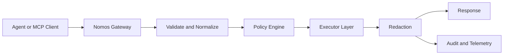

# Nomos

**Nomos is a zero-trust control plane for AI agent side effects.**

It governs execution authority at the boundary where actions touch real systems:

- policy-gated filesystem, exec, network, and secret operations
- deterministic deny-wins decisions
- output redaction before responses, logs, and telemetry
- auditable traces with replay-focused event fields

If you run Codex, Claude Code, OpenClaw, or custom agent loops, Nomos gives you a practical safety boundary.

## Why This Exists

Prompt-only safety cannot enforce real side effects. Nomos enforces at execution time.

Agent can still reason and plan freely. Nomos controls whether side effects execute.

## 60-Second Proof

From repo root:

```powershell
go build -o .\bin\nomos.exe .\cmd\nomos
.\bin\nomos.exe doctor -c .\examples\quickstart\config.quickstart.json --format json
.\bin\nomos.exe policy test --action .\examples\quickstart\actions\allow-readme.json --bundle .\policies\safe.yaml
.\bin\nomos.exe policy test --action .\examples\quickstart\actions\deny-env.json --bundle .\policies\safe.yaml
```

You should see one deterministic `ALLOW` and one deterministic `DENY`.

## Guarantees

| Deployment mode | Guarantee | Meaning |
| --- | --- | --- |
| `ci`, `k8s` with strong controls | `STRONG` | governed side effects are enforceable at runtime boundary |
| `ci`, `k8s` without full strong profile | `GUARDED` | mediated path is strong, but operator hardening gaps may remain |
| `remote_dev`, `unmanaged` | `BEST_EFFORT` | mediated path works, but full bypass resistance is not guaranteed |

See `docs/assurance-levels.md` and `docs/guarantees.md`.

## Architecture



## Install

### Go

```bash
go install github.com/safe-agentic-world/nomos/cmd/nomos@latest
```

### macOS and Linux installer

```bash
curl -fsSL https://raw.githubusercontent.com/safe-agentic-world/nomos/main/install.sh | sh
```

### Homebrew (macOS and Linux)

```bash
brew tap safe-agentic-world/packages-nomos
brew install nomos
```

### Scoop (Windows)

```powershell
scoop bucket add packages-nomos https://github.com/safe-agentic-world/packages-nomos
scoop install nomos
```

## Run Nomos

### HTTP mode

```powershell
.\bin\nomos.exe serve -c .\examples\quickstart\config.quickstart.json -p .\policies\safe.yaml
```

### MCP stdio mode

```powershell
.\bin\nomos.exe mcp -c .\examples\quickstart\config.quickstart.json -p .\policies\safe.yaml
```

## Testing

For full local and release-grade test commands, see `TESTING.md`.

Quick release gate:

```powershell
go test ./...
go test -race ./...
go vet ./...
.\bin\nomos.exe doctor -c .\examples\quickstart\config.quickstart.json --format json
```

## Starter Policies

- `policies/safe.{json,yaml}`: secure local baseline
- `policies/guarded-prod.{json,yaml}`: production-oriented posture
- `policies/unsafe.{json,yaml}`: intentionally permissive for controlled testing only
- `policies/all-fields.example.{json,yaml}`: full schema and obligation surface example

## Security and Trust Docs

- `docs/threat-model.md`
- `docs/security-checklist.md`
- `docs/release-verification.md`
- `docs/supply-chain-security.md`
- `docs/owasp-agentic-mapping.md`
- `docs/strong-guarantee-deployment.md`

## Operator and Integration Docs

- `docs/quickstart.md`
- `docs/integration-kit.md`
- `docs/deployment.md`
- `docs/mcp-compatibility.md`
- `docs/observability.md`
- `docs/opa-interop.md`
- `docs/spiffe-spire.md`

## Launch Prep

- `TESTING.md` for deterministic test execution and release gating
- `docs/launch-checklist.md` for HN and Reddit launch-day workflow

## Governance

- `CONTRIBUTING.md`
- `SECURITY.md`
- `CODE_OF_CONDUCT.md`
- `CHANGELOG.md`
- `LICENSE`
