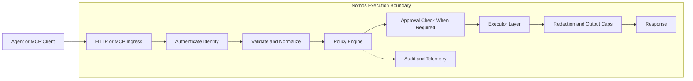

# Nomos

[](https://github.com/safe-agentic-world/nomos/actions/workflows/ci.yml)
[](https://github.com/safe-agentic-world/nomos/releases)
[](./go.mod)
[](./LICENSE)

**Nomos is an execution firewall for AI agents.**

It sits between agents and real actions such as reading files, changing code, running commands, calling APIs, and using credentials. Instead of trusting prompts or hoping the agent behaves, Nomos makes one explicit decision at the execution boundary:

- `ALLOW`
- `DENY`
- `REQUIRE_APPROVAL`

If your agent can still call arbitrary APIs, issue unwanted refunds, book free tickets, leak customer data, trigger `terraform destroy`, or run `git push origin main`, your safety boundary is at risk. Prompt injection, tool misuse, and over-broad credentials turn into real-world side effects fast. Nomos is built to enforce that boundary.

## Why It Exists

Agents can be genuinely useful, but they are still one bad tool call away from:

- grabbing secrets you did not mean to expose
- changing or deleting files you did not ask them to touch
- pushing code, shipping changes, or running destructive commands too early
- refunding money, booking something for free, or taking the wrong business action
- sending private data to the wrong place
- using powerful credentials in ways you never intended

Nomos does not try to control what the model thinks. It controls what the agent is actually allowed to do.

With Nomos:

- risky actions hit one control point before they happen
- policy returns `ALLOW`, `DENY`, or `REQUIRE_APPROVAL`
- sensitive actions can be routed to manual approval
- actions are normalized before policy evaluation, so decisions are deterministic
- approvals are bound to action fingerprints, so they cannot be replayed onto different inputs
- output can be redacted before it leaves the boundary
- audit evidence is produced for governed actions
- the same action can be tested, explained, and replayed against policy in a repeatable way
- the same boundary works across MCP and HTTP integrations

## Demo First

The fastest way to understand Nomos is to watch the same agent attempt the same action with and without Nomos in front of it.

Good launch demos:

1. A coding agent tries to read `.env` or run `git push` and Nomos denies it.
2. A customer-support agent tries to issue a refund and Nomos returns `REQUIRE_APPROVAL`.
3. A normal read action succeeds through Nomos, proving it is governance, not blanket obstruction.

Placeholder: add a short hero GIF or video here showing one safe action, one approval-gated action, and one denied action.

Placeholder: add a screenshot here of a blocked action with the Nomos decision visible.

Placeholder: add a screenshot here of an approval-gated action with approval metadata visible.

## Quickstart

This path uses only checked-in files and gives you one `ALLOW` and one `DENY` in a few minutes.

From the repo root:

```bash
nomos doctor -c ./examples/quickstart/config.quickstart.json --format json
nomos policy test --action ./examples/quickstart/actions/allow-readme.json --bundle ./examples/policies/safe.yaml
nomos policy test --action ./examples/quickstart/actions/deny-env.json --bundle ./examples/policies/safe.yaml
```

Expected result:

- `doctor` reports `READY`
- `allow-readme.json` returns `ALLOW`
- `deny-env.json` returns `DENY`

Example:

```text
ALLOW  fs.read  file://workspace/README.md
DENY   fs.read  file://workspace/.env
```

Then start Nomos in MCP mode:

```bash
nomos mcp -c ./examples/quickstart/config.quickstart.json
```

Register it in your MCP client with:

```json
{
  "command": "nomos",
  "args": ["mcp", "-c", "./examples/quickstart/config.quickstart.json"]
}
```

Then ask your agent to read:

- `file://workspace/README.md`
- `file://workspace/.env`

Expected result:

- `README.md` is allowed
- `.env` is denied

If you want the HTTP path instead:

```bash
nomos serve -c ./examples/quickstart/config.quickstart.json
python ./examples/openai-compatible/nomos_http_loop.py
```

Use `http://127.0.0.1:8080` locally.

See:

- [docs/quickstart.md](./docs/quickstart.md)
- [docs/local-test-plan.md](./docs/local-test-plan.md)
- [docs/local-rebuild-and-mcp-commands.md](./docs/local-rebuild-and-mcp-commands.md)

## Install

### Homebrew

```bash
brew install safe-agentic-world/nomos/nomos
```

### Scoop

```powershell
scoop bucket add nomos https://github.com/safe-agentic-world/scoop-nomos
scoop install nomos
```

### Go

```bash
go install github.com/safe-agentic-world/nomos/cmd/nomos@latest
```

### macOS And Linux Installer

```bash
curl -fsSL https://raw.githubusercontent.com/safe-agentic-world/nomos/main/install.sh | sh
```

## How Nomos Fits

Nomos is agent-agnostic. You can put it in front of different agent frameworks and clients through two main integration paths:

### MCP

Use Nomos as an MCP server when your agent client already knows how to use MCP tools.

Good fit for:

- Claude Code
- Codex-style tool clients
- OpenClaw-style MCP-connected agents

Nomos exposes governed tools such as:

- `nomos.fs_read`
- `nomos.fs_write`
- `nomos.apply_patch`
- `nomos.exec`
- `nomos.http_request`

See:

- [docs/integration-kit.md](./docs/integration-kit.md)
- [docs/mcp-compatibility.md](./docs/mcp-compatibility.md)
- [examples/local-tooling/claude-code-mcp.json](./examples/local-tooling/claude-code-mcp.json)
- [examples/local-tooling/codex.mcp.json](./examples/local-tooling/codex.mcp.json)

### HTTP

Use Nomos as an HTTP gateway when your agent runtime already has its own tool loop or backend service.

Good fit for:

- app-integrated agents
- custom tool runtimes
- CI or service-side control planes

Nomos exposes:

- `POST /action`
- `POST /run`

with bearer principal auth and agent HMAC signing.

See:

- [docs/deployment.md](./docs/deployment.md)
- [docs/quickstart.md](./docs/quickstart.md)

## What Nomos Governs

Nomos governs actions such as:

- `fs.read`
- `fs.write`
- `repo.apply_patch`
- `process.exec`
- `net.http_request`
- `secrets.checkout`

Policy returns:

- `ALLOW`
- `DENY`
- `REQUIRE_APPROVAL`

Around those actions, Nomos adds:

- deterministic deny-wins policy evaluation
- approval binding to action fingerprints
- output caps and redaction
- audit events and telemetry hooks
- least-privilege identity and credential mediation

See:

- [docs/policy-language.md](./docs/policy-language.md)
- [docs/obligations.md](./docs/obligations.md)
- [docs/approvals.md](./docs/approvals.md)
- [docs/audit-schema.md](./docs/audit-schema.md)

Nomos is not an agent framework, a prompt guardrail library, a sandbox runtime by itself, or a secrets manager. It is the layer that decides whether an agent gets to carry out a real action.

## Real-World Use Cases

### Coding Agents

- allow `git status`
- deny `git push`
- deny `.env` reads
- allow bounded patch application

### Customer Operations Agents

- allow order lookup
- require approval for refunds or credits
- deny bulk customer export

### CI Agents

- allow test execution
- deny release publishing outside policy
- require approval for production-impacting actions

See:

- [docs/use-cases.md](./docs/use-cases.md)
- [deploy/ci/github-actions-quickstart.yml](./deploy/ci/github-actions-quickstart.yml)
- [deploy/ci/github-actions-hardened.yml](./deploy/ci/github-actions-hardened.yml)

## Architecture In One Picture



Core path:

1. authenticate identity
2. validate and normalize the action
3. evaluate policy deterministically
4. require approval when policy says so
5. execute only if allowed
6. redact before returning output
7. emit audit evidence

Placeholder: add an architecture diagram image here if you want a branded version instead of Mermaid.

## Guarantees And Deployment Modes

Nomos makes different claims depending on where it is deployed. These are runtime-derived assurance levels, not marketing labels.

| Deployment mode | Guarantee | Meaning |
| --- | --- | --- |
| controlled CI / k8s with strong controls | `STRONG` | governed side effects can be enforced at the runtime boundary |
| partially hardened controlled runtime | `GUARDED` | Nomos strongly mediates the path it sees, but operator/runtime gaps may remain |
| local unmanaged or remote-dev style usage | `BEST_EFFORT` | Nomos governs routed actions, but cannot guarantee full mediation |

This matters because a local demo proves Nomos can govern the path it sees, while a hardened deployment proves much stronger control over what the agent can actually do.

See:

- [docs/assurance-levels.md](./docs/assurance-levels.md)
- [docs/guarantees.md](./docs/guarantees.md)
- [docs/strong-guarantee-deployment.md](./docs/strong-guarantee-deployment.md)
- [docs/reference-architecture.md](./docs/reference-architecture.md)

## Starter Bundles And Examples

These are starter examples, not built-in enterprise policy packs.

Configs:

- [examples/quickstart/config.quickstart.json](./examples/quickstart/config.quickstart.json)
- [examples/configs/config.example.json](./examples/configs/config.example.json)
- [examples/configs/config.layered.example.json](./examples/configs/config.layered.example.json)

Starter bundles:

- [examples/policies/safe.yaml](./examples/policies/safe.yaml)
- [examples/policies/safe.json](./examples/policies/safe.json)
- [examples/policies/purchase.yaml](./examples/policies/purchase.yaml)
- [examples/policies/all-fields.example.yaml](./examples/policies/all-fields.example.yaml)

## Security Model

Nomos is built around a few hard rules:

- no trust in agent-supplied principal or environment claims
- no raw enterprise credentials returned directly to agents
- credentials are brokered as short-lived lease IDs
- redaction happens before output leaves Nomos
- policy and config errors fail closed
- local unmanaged mediation is explicitly weaker than controlled-runtime mediation

See:

- [docs/threat-model.md](./docs/threat-model.md)
- [docs/redaction-guarantees.md](./docs/redaction-guarantees.md)
- [docs/egress-and-identity.md](./docs/egress-and-identity.md)
- [docs/owasp-agentic-mapping.md](./docs/owasp-agentic-mapping.md)

## Why Not Just Use OPA, Vault, Or Sandboxes?

Those tools solve pieces of the problem.

| Tool | What it primarily solves |
| --- | --- |
| OPA | policy evaluation |
| Vault | secret storage |
| sandbox runtimes | process isolation |
| MCP servers | tool exposure |

Nomos puts policy, approvals, redaction, and audit around the moment an agent tries to do something real.

## Testing

Quick validation:

```bash
go test ./...
nomos doctor -c ./examples/quickstart/config.quickstart.json --format json
nomos policy test --action ./examples/quickstart/actions/allow-readme.json --bundle ./examples/policies/safe.yaml
nomos policy test --action ./examples/quickstart/actions/deny-env.json --bundle ./examples/policies/safe.yaml
```

See:

- [TESTING.md](./TESTING.md)
- [docs/local-test-plan.md](./docs/local-test-plan.md)

## Docs Map

Start here:

- [docs/quickstart.md](./docs/quickstart.md)
- [docs/integration-kit.md](./docs/integration-kit.md)
- [docs/local-test-plan.md](./docs/local-test-plan.md)

Policy and behavior:

- [docs/policy-language.md](./docs/policy-language.md)
- [docs/policy-explain.md](./docs/policy-explain.md)
- [docs/obligations.md](./docs/obligations.md)
- [docs/approvals.md](./docs/approvals.md)

Architecture and guarantees:

- [docs/reference-architecture.md](./docs/reference-architecture.md)
- [docs/assurance-levels.md](./docs/assurance-levels.md)
- [docs/audit-schema.md](./docs/audit-schema.md)
- [docs/observability.md](./docs/observability.md)

Security and standards:

- [docs/threat-model.md](./docs/threat-model.md)
- [docs/mcp-compatibility.md](./docs/mcp-compatibility.md)
- [docs/supply-chain-security.md](./docs/supply-chain-security.md)
- [docs/release-verification.md](./docs/release-verification.md)
- [docs/owasp-agentic-mapping.md](./docs/owasp-agentic-mapping.md)

## Community And Contribution

- open an issue for bugs, gaps, integration requests, or deployment questions
- browse [`good first issue`](https://github.com/safe-agentic-world/nomos/issues?q=is%3Aissue+is%3Aopen+label%3A%22good+first+issue%22) if you want a place to start
- read [CONTRIBUTING.md](./CONTRIBUTING.md) if you want to help shape the project

Project governance:

- [SECURITY.md](./SECURITY.md)
- [CODE_OF_CONDUCT.md](./CODE_OF_CONDUCT.md)
- [CHANGELOG.md](./CHANGELOG.md)
- [LICENSE](./LICENSE)
