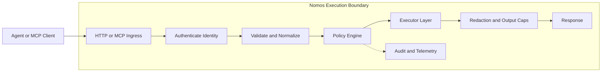

# Nomos

[](https://github.com/safe-agentic-world/nomos/actions/workflows/ci.yml)
[](https://github.com/safe-agentic-world/nomos/releases)
[](./go.mod)
[](./LICENSE)

Quickstart: allow one action, deny one action, inspect one audit event in 5 minutes.

**Nomos is a zero-trust control plane for AI agent side effects.** It acts as an **execution firewall for agent actions**. Every filesystem change, command, HTTP call, or credential access passes through Nomos, where deterministic policy decides whether the action is allowed.

If an agent can still read `.env`, run `git push`, call arbitrary APIs, or print secrets into logs, your safety boundary is advisory. Agents do not receive raw enterprise credentials. It mediates actions like:

- reading `.env` or SSH keys
- applying code patches
- running shell commands
- calling external APIs
- retrieving credentials

The checked-in configs and policy bundles in this repo are starter examples only. Nomos is agent-agnostic and runtime policy-agnostic: teams are expected to supply and customize their own policies.

Nomos does **not** try to control model reasoning. It controls **execution authority**.

## Quick Demo

This path uses only checked-in files and gives you one `ALLOW` and one `DENY`.
If you are evaluating Nomos for Claude Code or Codex, start with MCP mode first.

From the repo root:

```bash
nomos doctor -c ./examples/quickstart/config.quickstart.json --format json
nomos policy test --action ./examples/quickstart/actions/allow-readme.json --bundle ./examples/policies/safe.yaml
nomos policy test --action ./examples/quickstart/actions/deny-env.json --bundle ./examples/policies/safe.yaml
```

Expected result:

- `doctor` reports `READY`
- `allow-readme.json` returns `ALLOW`
- `deny-env.json` returns `DENY`

Sample result lines:

```text
ALLOW  fs.read  file://workspace/README.md
DENY   fs.read  file://workspace/.env
```

Then start MCP mode:

```bash
nomos mcp -c ./examples/quickstart/config.quickstart.json
```

This works without `-p` because `examples/quickstart/config.quickstart.json` already sets `policy.policy_bundle_path`.

Register it in Claude Code with:

```json
{
  "command": "nomos",
  "args": ["mcp", "-c", "./examples/quickstart/config.quickstart.json"]
}
```

Then ask your agent to use canonical Nomos file resources, for example `file://workspace/README.md` and `file://workspace/.env`.

Expected result: `README.md` is allowed and `.env` is denied.

Don't have Claude Code or Codex installed? Run the HTTP example instead:

```bash
nomos serve -c ./examples/quickstart/config.quickstart.json
python ./examples/openai-compatible/nomos_http_loop.py
```

The startup log shows `gateway listening on :8080 (http)`.
Use `http://127.0.0.1:8080` locally.

That HTTP example sends:

- one allowed `fs.read` for `README.md`
- one denied `fs.read` for `.env`

Windows users can translate `./path` to `.\path` directly.

## Before / After

Without Nomos:

- the agent has direct file, shell, network, or credential access
- prompt guardrails are advisory
- denials are inconsistent or absent
- audit is partial or bolted on afterward

With Nomos:

- risky actions pass through a single deterministic execution boundary
- policy decides `ALLOW`, `DENY`, or `REQUIRE_APPROVAL`
- outputs are redacted before they leave the system
- every action can emit replayable audit events

## What You Get

- deterministic deny-wins policy decisions
- bounded executor surfaces for `fs`, `patch`, `exec`, `http`, and secrets
- approvals tied to action fingerprints
- redaction before responses, logs, audit, and telemetry
- MCP stdio mode for agent tools and HTTP mode for tool loops

## What Nomos Is Not

Nomos is not:

- an agent framework
- a prompt guardrail library
- a sandbox runtime by itself
- a secrets manager

Nomos is the **execution governance layer** that sits between agents and real systems.

## Why Not Just Use OPA, Vault, or Sandboxes?

Those tools solve pieces of the problem.

| Tool | What it solves |
| --- | --- |
| OPA | policy evaluation |
| Vault | secret storage |
| sandboxes | process isolation |
| MCP servers | tool exposure |

Nomos composes these concerns into a **single deterministic execution boundary** for agent actions.
The differentiator is policy + mediation + execution + redaction + audit in one boundary.

## Who It Is For

- teams running coding agents in CI
- operators exposing agent tools in Kubernetes or controlled runtimes
- developers who want a practical local mediation layer for Claude Code or similar tools
- security teams that want explicit, narrow, evidence-backed guarantees instead of vague "AI safety" claims

## See It Deny Something

This is the product proof in one glance.

```text
Agent request
  fs.read file://workspace/.env

Nomos decision
  DENY (policy: safe)

Why
  .env reads are denied by the safe starter policy
```

```json
{
  "event_type": "action.completed",
  "action_type": "fs.read",
  "resource_normalized": "file://workspace/.env",
  "decision": "DENY",
  "matched_rule_ids": ["safe-deny-root-env"],
  "policy_bundle_hash": "<sha256 bundle hash>",
  "result_classification": "DENIED_POLICY",
  "retryable": false
}
```

_Placeholder: add terminal screenshot or short GIF of the deny flow here._

## Quick Mental Model



Nomos is most useful when:

- the agent is untrusted
- the side effects matter
- you want a repeatable, reviewable control point

## Deployment Guarantees

Nomos makes different claims depending on the environment. These guarantee levels are derived from runtime conditions, not marketing labels.

| Deployment mode | Guarantee | Meaning |
| --- | --- | --- |
| `ci`, `k8s` with strong controls | `STRONG` | governed side effects can be enforced at the runtime boundary |
| `ci`, `k8s` without full strong profile | `GUARDED` | Nomos strongly mediates the path it sees, but operator/runtime gaps may remain |
| `remote_dev`, `unmanaged` | `BEST_EFFORT` | Nomos governs routed actions, but cannot guarantee full mediation |

See:

- [docs/assurance-levels.md](./docs/assurance-levels.md)
- [docs/guarantees.md](./docs/guarantees.md)
- [docs/strong-guarantee-deployment.md](./docs/strong-guarantee-deployment.md)
- [docs/reference-architecture.md](./docs/reference-architecture.md)

## Install

### Homebrew

```bash
brew install safe-agentic-world/nomos/nomos
```

### Scoop

```powershell
scoop bucket add nomos https://github.com/safe-agentic-world/scoop-nomos
scoop install nomos
```

### Go

```bash
go install github.com/safe-agentic-world/nomos/cmd/nomos@latest
```

### macOS and Linux Installer

```bash
curl -fsSL https://raw.githubusercontent.com/safe-agentic-world/nomos/main/install.sh | sh
```

## Core Concepts

| Concept | Meaning | Examples |
| --- | --- | --- |
| Action | Every request becomes a typed action | `fs.read`, `fs.write`, `repo.apply_patch`, `process.exec`, `net.http_request`, `secrets.checkout` |
| Resource | Every action targets a normalized resource URI | `file://workspace/README.md`, `url://api.example.com/v1/foo`, `secret://vault/github_token` |
| Policy | Policy is deterministic, side-effect free, and deny-wins | `ALLOW`, `DENY`, `REQUIRE_APPROVAL` |
| Obligations | Matched rules can attach runtime constraints | sandbox mode, network allowlist, exec allowlist, redirect policy, output caps, approval scope |

See:

- [docs/policy-language.md](./docs/policy-language.md)
- [docs/obligations.md](./docs/obligations.md)
- [docs/policy-explain.md](./docs/policy-explain.md)

## Common Ways To Use It

### 1. Protect Claude Code / Codex With MCP

Start MCP mode:

```bash
nomos mcp -c ./examples/quickstart/config.quickstart.json
```

Then register `nomos` as an MCP server in your agent client.

Nomos keeps stdout protocol-pure in MCP mode. Human-readable logs and the ready banner go to stderr.

See:

- [docs/integration-kit.md](./docs/integration-kit.md)
- [examples/local-tooling/codex.mcp.json](./examples/local-tooling/codex.mcp.json)
- [examples/local-tooling/claude-code-mcp.json](./examples/local-tooling/claude-code-mcp.json)

### 2. Run Nomos As An HTTP Policy Gateway

Start HTTP mode:

```bash
nomos serve -c ./examples/quickstart/config.quickstart.json
```

Use:

- `POST /action`
- `POST /run`

with bearer principal auth plus agent HMAC signing.

See:

- [docs/deployment.md](./docs/deployment.md)
- [docs/quickstart.md](./docs/quickstart.md)

## Where Nomos Fits

Nomos is adjacent to several categories, but it is not the same thing as any one of them.

| Category | Primary job | What Nomos adds |
| --- | --- | --- |
| Agent framework | planning, tool orchestration, model loop | governed execution boundary |
| Guardrail library | prompt or response constraints | real side-effect mediation |
| Sandbox | process or host isolation | policy, approvals, redaction, and audit around actions |
| Secret manager | store and issue secrets | executor-bound credential use and audit context |

### 3. Enforce Agent Safety In CI

Use Nomos in CI to validate what the agent is allowed to do before a publish or merge boundary.

See:

- [deploy/ci/github-actions-quickstart.yml](./deploy/ci/github-actions-quickstart.yml)
- [deploy/ci/github-actions-hardened.yml](./deploy/ci/github-actions-hardened.yml)
- [deploy/ci/generic-ci.sh](./deploy/ci/generic-ci.sh)

## Starter Policy Bundles

These are starter examples, not built-in policy dependencies.

| Bundle | Formats | Purpose |
| --- | --- | --- |
| `safe` | [YAML](./examples/policies/safe.yaml), [JSON](./examples/policies/safe.json) | Secure local starter policy |
| `all-fields.example` | [YAML](./examples/policies/all-fields.example.yaml), [JSON](./examples/policies/all-fields.example.json) | Full schema and obligations reference |

## Security Model

Important design rules:

- no trust in agent-supplied principal or environment claims
- no raw enterprise credentials returned to agents
- credentials are brokered as short-lived lease IDs
- redaction happens before output leaves Nomos
- policy/config errors fail closed
- local unmanaged mediation is explicitly weaker than controlled-runtime mediation

Security Review Mapping:
Nomos also includes an explicit control mapping to the [OWASP Agentic Top 10](./docs/owasp-agentic-mapping.md) for security review and buyer evaluation.

See:

- [docs/threat-model.md](./docs/threat-model.md)
- [docs/redaction-guarantees.md](./docs/redaction-guarantees.md)
- [docs/egress-and-identity.md](./docs/egress-and-identity.md)
- [docs/approvals.md](./docs/approvals.md)

## Testing

Quick local validation:

```bash
go test ./...
nomos doctor -c ./examples/quickstart/config.quickstart.json --format json
nomos policy test --action ./examples/quickstart/actions/allow-readme.json --bundle ./examples/policies/safe.yaml
nomos policy test --action ./examples/quickstart/actions/deny-env.json --bundle ./examples/policies/safe.yaml
```

For the full operator runbook:

- [docs/local-test-plan.md](./docs/local-test-plan.md)
- [TESTING.md](./TESTING.md)

## Current Status

Nomos is pre-`v1.0.0`.

The core gateway, policy engine, audit path, and starter bundles are implemented today.

The repository is already opinionated about:

- deterministic semantics
- fail-closed defaults
- explicit guarantee boundaries
- controlled-runtime hardening

It is intentionally conservative about claims in unmanaged local environments.

## Documentation Map

Start here:

- [docs/quickstart.md](./docs/quickstart.md)
- [docs/integration-kit.md](./docs/integration-kit.md)
- [docs/local-test-plan.md](./docs/local-test-plan.md)

Architecture and guarantees:

- [docs/reference-architecture.md](./docs/reference-architecture.md)
- [docs/assurance-levels.md](./docs/assurance-levels.md)
- [docs/audit-schema.md](./docs/audit-schema.md)
- [docs/observability.md](./docs/observability.md)

Security and Standards:

- [docs/opa-interop.md](./docs/opa-interop.md)
- [docs/spiffe-spire.md](./docs/spiffe-spire.md)
- [docs/mcp-compatibility.md](./docs/mcp-compatibility.md)
- [docs/supply-chain-security.md](./docs/supply-chain-security.md)
- [docs/release-verification.md](./docs/release-verification.md)
- [docs/owasp-agentic-mapping.md](./docs/owasp-agentic-mapping.md)

## Community And Contribution

- If Nomos is solving a problem you care about, a [star](https://github.com/safe-agentic-world/nomos) goes a long way and helps more people find it.
- Open an issue for gaps, deployment questions, or integration requests.
- Looking for a place to start? Browse [`good first issue`](https://github.com/safe-agentic-world/nomos/issues?q=is%3Aissue+is%3Aopen+label%3A%22good+first+issue%22).
- If you want to help shape Nomos, read [CONTRIBUTING.md](./CONTRIBUTING.md) and jump in with code, docs, feedback, or issues.

Project governance:

- [SECURITY.md](./SECURITY.md)
- [CODE_OF_CONDUCT.md](./CODE_OF_CONDUCT.md)
- [CHANGELOG.md](./CHANGELOG.md)
- [LICENSE](./LICENSE)
