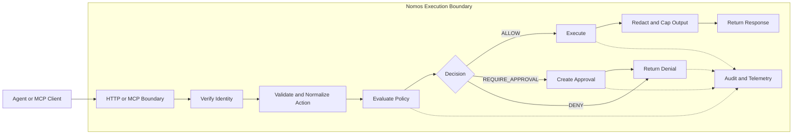

# Nomos

[](https://github.com/safe-agentic-world/nomos/actions/workflows/ci.yml)
[](https://github.com/safe-agentic-world/nomos/releases)
[](./go.mod)
[](./LICENSE)

**Nomos is an execution firewall for AI agents.**

It sits between agents and **real actions** such as reading files, changing code, running commands, calling APIs, and using credentials. Instead of trusting prompts or hoping the agent behaves, Nomos makes one explicit decision at the **execution boundary**:

- `ALLOW`
- `DENY`
- `REQUIRE_APPROVAL`

Nomos is **agent-agnostic** and **model-agnostic**. You can put it in front of different agent frameworks, different model providers, and different tool runtimes, then shape its behavior with your own **policies** and **configs**.


## Why Nomos Exists

Agents can be useful, but they are still one bad tool call away from:

- wrong and unwanted business actions like refunding money, booking something for free due to prompt injection. 
- pushing code, shipping changes, or running destructive commands like `terraform destroy`, `git push origin main`, or `kubectl delete`
- changing or deleting files you did not ask it to touch
- using powerful credentials in ways you never intended

If your agent can still call arbitrary APIs or leak customer data, your safety boundary is **at risk**. **Prompt injection**, tool misuse, and over-broad credentials turn into real side effects fast. Nomos applies **zero-trust controls** at the moment an agent tries to do something real. It does not control the model's reasoning. It controls what the agent is actually allowed to do.

With Nomos:

- routed actions hit **one control point** before they happen
- the same normalized action gets the same decision under the same identity, environment, and policy bundle
- sensitive actions can be routed to **manual approval**
- agents do not need to hold **long-lived enterprise credentials** on the Nomos-governed path
- outputs can be **redacted** and governed actions produce **audit evidence**
- the same control model works across **MCP** and **HTTP** integrations
- behavior stays flexible because you shape it with your own **policies** and **configs**

## Demo First

The fastest way to understand Nomos is to watch the **same agent** attempt the **same action** with and without Nomos in front of it.

1. A coding agent tries to read `.env` or run `git push` and Nomos **denies** it.
2. A customer-support agent tries to issue a refund and Nomos returns **`REQUIRE_APPROVAL`**.
3. A normal read action succeeds through Nomos, proving it is **governance**, not blanket obstruction.

## Install

### Homebrew (macOS)

```bash
brew install safe-agentic-world/nomos/nomos
```

### Scoop (Windows)

```powershell
scoop bucket add nomos https://github.com/safe-agentic-world/scoop-nomos
scoop install nomos
```

### Build From Source (Go)

```bash
go install github.com/safe-agentic-world/nomos/cmd/nomos@latest
```

### Shell Installer (macOS And Linux)

```bash
curl -fsSL https://raw.githubusercontent.com/safe-agentic-world/nomos/main/install.sh | sh
```

## Architecture In One Picture



The flow is simple:

1. an agent tries to do something real
2. Nomos verifies who is asking and normalizes the action
3. policy returns `ALLOW`, `DENY`, or `REQUIRE_APPROVAL`
4. only allowed actions execute on the mediated path
5. outputs are redacted before they come back
6. audit evidence is recorded for the whole path

That same model works whether the agent reaches Nomos through MCP or HTTP.

## Serve

### MCP

Use Nomos as an **MCP server** when your agent client already knows how to use MCP tools.

Good fit for:

- Claude Code
- Codex-style tool clients
- OpenClaw-style MCP-connected agents

Nomos exposes governed tools such as:

- `nomos.fs_read`
- `nomos.fs_write`
- `nomos.apply_patch`
- `nomos.exec`
- `nomos.http_request`

See:

- [docs/integration-kit.md](./docs/integration-kit.md)
- [docs/mcp-compatibility.md](./docs/mcp-compatibility.md)
- [examples/local-tooling/claude-code-mcp.json](./examples/local-tooling/claude-code-mcp.json)
- [examples/local-tooling/codex.mcp.json](./examples/local-tooling/codex.mcp.json)

### HTTP

Use Nomos as an **HTTP gateway** when your agent runtime already has its own tool loop or backend service.

Good fit for:

- app-integrated agents
- custom tool runtimes
- CI or service-side control planes

Nomos exposes:

- `POST /action`
- `POST /run`
- `POST /approvals/decide`
- `POST /explain`
- `GET /ui/`

with bearer principal auth and agent HMAC signing.

See:

- [docs/deployment.md](./docs/deployment.md)
- [docs/http-sdk.md](./docs/http-sdk.md)
- [docs/quickstart.md](./docs/quickstart.md)
- [docs/operator-ui.md](./docs/operator-ui.md)

## Key Features

- `nomos doctor`: deterministic preflight checks before agents connect
- `nomos policy test`: test a specific action against a policy bundle without executing it
- `nomos policy explain`: understand why an action was allowed, denied, or approval-gated
- **MCP** server mode: expose governed tools to MCP-compatible agent clients
- **HTTP** gateway mode: mediate actions from custom tool loops and app backends
- approval workflow: route sensitive actions into narrow, fingerprint-bound approvals
- operator UI: inspect readiness, pending approvals, action detail, trace timelines, and explain-only policy results over existing gateway state
- audit trail: record governed actions with stable policy and identity context
- redaction: strip sensitive output before it reaches the agent, logs, or audit sinks
- capability contract: surface what is immediately allowed, approval-gated, or unavailable
- multi-bundle policy loading: compose layered policy packs with deterministic merge behavior


## What Nomos Governs

Nomos can govern actions such as:

- `fs.read`
- `fs.write`
- `repo.apply_patch`
- `process.exec`
- `net.http_request`
- `secrets.checkout`

Policy returns:

- `ALLOW`
- `DENY`
- `REQUIRE_APPROVAL`

Around those actions, Nomos adds:

- deterministic **deny-wins** policy evaluation
- approval binding to action fingerprints
- output caps and **redaction**
- **audit events** and telemetry hooks
- **least-privilege** identity and credential mediation

See:

- [docs/policy-language.md](./docs/policy-language.md)
- [docs/obligations.md](./docs/obligations.md)
- [docs/approvals.md](./docs/approvals.md)
- [docs/audit-schema.md](./docs/audit-schema.md)

## Guarantees And Deployment Modes

Nomos makes different claims depending on where it is deployed. These are runtime-derived **assurance levels**, not marketing labels.

| Deployment mode | Guarantee | Meaning |
| --- | --- | --- |
| controlled CI / k8s with strong controls | `STRONG` | governed side effects can be enforced at the runtime boundary |
| partially hardened controlled runtime | `GUARDED` | Nomos strongly mediates the path it sees, but operator/runtime gaps may remain |
| local unmanaged or remote-dev style usage | `BEST_EFFORT` | Nomos governs routed actions, but cannot guarantee full mediation |

This matters because a local demo proves Nomos can govern the **path it sees**, while a hardened deployment proves much stronger control over what the agent can actually do.

See:

- [docs/assurance-levels.md](./docs/assurance-levels.md)
- [docs/guarantees.md](./docs/guarantees.md)
- [docs/strong-guarantee-deployment.md](./docs/strong-guarantee-deployment.md)
- [docs/reference-architecture.md](./docs/reference-architecture.md)

## Starter Bundles And Examples

These are starter examples, not built-in enterprise policy packs.

Configs:

- [examples/quickstart/config.quickstart.json](./examples/quickstart/config.quickstart.json)
- [examples/configs/config.example.json](./examples/configs/config.example.json)
- [examples/configs/config.layered.example.json](./examples/configs/config.layered.example.json)

Starter bundles:

- [examples/policies/safe.yaml](./examples/policies/safe.yaml)
- [examples/policies/safe.json](./examples/policies/safe.json)
- [examples/policies/purchase.yaml](./examples/policies/purchase.yaml)
- [examples/policies/all-fields.example.yaml](./examples/policies/all-fields.example.yaml)

## Security Model

Nomos is built around a few **hard rules**:

- no trust in agent-supplied principal or environment claims
- no raw enterprise credentials returned directly to agents
- credentials are brokered as **short-lived lease IDs**
- redaction happens before output leaves Nomos
- policy and config errors **fail closed**
- local unmanaged mediation is explicitly weaker than controlled-runtime mediation

See:

- [docs/threat-model.md](./docs/threat-model.md)
- [docs/redaction-guarantees.md](./docs/redaction-guarantees.md)
- [docs/egress-and-identity.md](./docs/egress-and-identity.md)
- [docs/owasp-agentic-mapping.md](./docs/owasp-agentic-mapping.md)

## Why Not Just Use OPA, Vault, Or Sandboxes?

Those tools solve pieces of the problem.

| Tool | What it primarily solves |
| --- | --- |
| OPA | policy evaluation |
| Vault | secret storage |
| sandbox runtimes | process isolation |
| MCP servers | tool exposure |

Nomos puts **policy**, **approvals**, **redaction**, and **audit** around the moment an agent tries to do something real on the mediated path.

## Testing

Quick validation:

```bash
go test ./...
nomos doctor -c ./examples/quickstart/config.quickstart.json --format json
nomos policy test --action ./examples/quickstart/actions/allow-readme.json --bundle ./examples/policies/safe.yaml
nomos policy test --action ./examples/quickstart/actions/deny-env.json --bundle ./examples/policies/safe.yaml
```

See:

- [TESTING.md](./TESTING.md)
- [docs/local-test-plan.md](./docs/local-test-plan.md)

## Few More Use Cases

### Coding Agents

- allow `git status`
- deny `git push`
- deny `.env` reads
- allow bounded patch application

### Customer Operations Agents

- allow order lookup
- require approval for refunds or credits
- deny bulk customer export

### CI Agents

- allow test execution
- deny release publishing outside policy
- require approval for production-impacting actions

See:

- [docs/use-cases.md](./docs/use-cases.md)
- [deploy/ci/github-actions-quickstart.yml](./deploy/ci/github-actions-quickstart.yml)
- [deploy/ci/github-actions-hardened.yml](./deploy/ci/github-actions-hardened.yml)


## Docs Map

Start here:

- [docs/quickstart.md](./docs/quickstart.md)
- [docs/http-sdk.md](./docs/http-sdk.md)
- [docs/integration-kit.md](./docs/integration-kit.md)
- [docs/local-test-plan.md](./docs/local-test-plan.md)
- [docs/operator-ui.md](./docs/operator-ui.md)

Policy and behavior:

- [docs/policy-language.md](./docs/policy-language.md)
- [docs/policy-explain.md](./docs/policy-explain.md)
- [docs/obligations.md](./docs/obligations.md)
- [docs/approvals.md](./docs/approvals.md)

Architecture and guarantees:

- [docs/reference-architecture.md](./docs/reference-architecture.md)
- [docs/assurance-levels.md](./docs/assurance-levels.md)
- [docs/audit-schema.md](./docs/audit-schema.md)
- [docs/observability.md](./docs/observability.md)

Security and standards:

- [docs/threat-model.md](./docs/threat-model.md)
- [docs/mcp-compatibility.md](./docs/mcp-compatibility.md)
- [docs/supply-chain-security.md](./docs/supply-chain-security.md)
- [docs/release-verification.md](./docs/release-verification.md)
- [docs/owasp-agentic-mapping.md](./docs/owasp-agentic-mapping.md)

## Project Status

Nomos is still **pre-v1.0.0**. The core model is usable today, but interfaces, policy surface, and integrations may still evolve before a stable `v1`.

Project governance:

- [SECURITY.md](./SECURITY.md)
- [CODE_OF_CONDUCT.md](./CODE_OF_CONDUCT.md)
- [CHANGELOG.md](./CHANGELOG.md)
- [LICENSE](./LICENSE)

## Community And Contribution

- open an issue for bugs, gaps, integration requests, or deployment questions.
- Please do not open public issues for potential vulnerabilities, and report privately to maintainers. 
- browse [`good first issue`](https://github.com/safe-agentic-world/nomos/issues?q=is%3Aissue+is%3Aopen+label%3A%22good+first+issue%22) if you want a place to start
- read [CONTRIBUTING.md](./CONTRIBUTING.md) if you want to help shape the project
